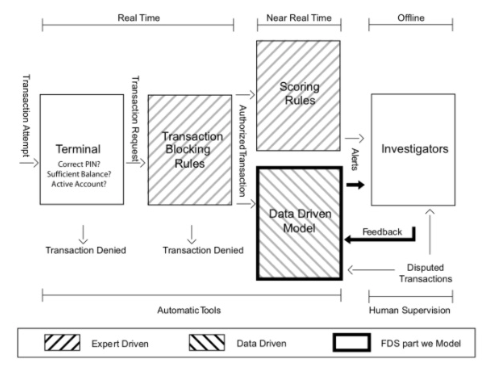

fraud-detection-system
==============================
[](https://github.com/psf/black)


- [Origin](https://github.com/HeberTU/fraud-detection-system)
- Authors: 
  - Heber Trujillo <heber.trj.urt@gmail.com>
- Date of last README.md update: 04.10.2023

 
This repository guides the construction of a machine learning platform tailored for a fraud detection system. We adhere to core software design principles and adopt best practices in designing machine learning systems throughout. Our approach is inspired by and draws heavily from the techniques and methodologies outlined in the following works: 

1. Le Borgne, Yann-Aël et al. (2022). 
[Reproducible Machine Learning for Credit Card Fraud Detection - Practical Handbook](https://fraud-detection-handbook.github.io/fraud-detection-handbook/Foreword.html). 
Université Libre de Bruxelles.
2. Huyen, Chip (2022). [Designing Machine Learning Systems](https://learning.oreilly.com/library/view/designing-machine-learning/9781098107956/).
3. Martin, Robert C. "Uncle Bob" (2017). [Clean Architecture: A Craftsman's Guide to Software Structure and Design](https://learning.oreilly.com/library/view/clean-architecture-a/9780134494272/).
4. Valliappa Lakshmanan et al. (2020) [Machine Learning Design Patterns](https://learning.oreilly.com/library/view/machine-learning-design/9781098115777/)


## Project Overview


### Motivation

Credit card fraud has become a pervasive issue worldwide, with the Statistic Brain Research Institute citing that one in ten Americans has fallen victim, with a median loss of $399. In the Single European Payment Area (SEPA), card fraud losses reached €1.8 billion in 2018. The fraud landscape is diverse, with varying scenarios making detection challenging. Fraudsters consistently adapt, exploiting technological advancements and evolving genuine transaction characteristics.

### Fraud Detection System (FDS) Architecture

A credit card Fraud Detection System (FDS) typically comprises five layers of control, as illustrated in the following image from the book.



1. Terminal: This initial layer conducts basic security checks on all real-time payment requests.

2. Transaction-Blocking Rules: These expert-driven rules block transactions perceived as potential fraud. They operate without delving into historical data or user profiles.

3. Scoring Rules: Expert-designed rules that assign a risk score to each transaction based on feature vectors. Higher scores indicate a higher likelihood of the transaction being fraudulent.

4. Data-Driven Model (DDM): This layer leverages machine learning models to predict the likelihood of a transaction being fraudulent. It uses feature vectors derived from transaction data and lacks manual interventions.

5. Investigators: These professionals design the aforementioned rules, handle alerts raised by the DDM, and determine the genuineness of transactions. They bridge automated systems and human judgment, thoroughly examining potential risks.

Although this repository will focus on building the DDM layer, I'll design this layer holistically, that is, considering not just the ML-related challenges but taking into consideration operational constraints such as latency, business impact (business-related metrics, e.g., Card Precision top-k), artifacts management, etc.

### Repository Contents

The repository has the following library structure inside the corelib package:

* Data repositories: The data layer currently supports only a Transaction data simulator.
* Data Schemas: Data validation layer.
* Domain: A library containing all the domain-specific functions and abstractions.
* ML: A library containing all the ml related modules:
  *  algorithms: ml algorithms abstraction
  * arifact_repository: abstraction to interact with the artifactory registry for deployment
  * estimator: A composite class used to implement the ML pipeline logic.
  * evaluator: Evaluation abstraction, the main implementation is focused on time-correlated evaluation scenarios.
  * hyperparam_optim: hyperparameter optimization.
  * metrics: ML & Domain metrics abstraction and implementations.
  * transformers: Feature transformer abstraction and implementations.


## How to Run Scripts 

## Docker

### Prerequisites

Ensure you have Docker installed on your machine. If not, you can download and install it from [here](https://docs.docker.com/get-docker/).

#### Build the Docker Image

1. Navigate to the directory containing the project
    ```zsh
    cd /path/to/fraud-detection-system
    ```

2. Build the Docker image. We'll name it fraud-detection-system:
    ```zsh
    docker build -t fraud-detection-system:latest . 
    ```

Note: The `.` at the end indicates the current directory which contains your Dockerfile.

#### Running the Container

After building the image, you can run the container using one of the two entry points:

1. **Train**
This entry point runs the training script.
    ```zsh
    docker run -it --name my_fraud_detection_container fraud-detection-system:latest train
    ```

2. Train with HPO (Hyperparameter Optimization):
    ```zsh
    docker run -it --name my_fraud_detection_container fraud-detection-system:latest train_hpo
    ```

Note:

* -it: These flags are combined to allow for an interactive session.

    * The -i flag keeps the standard input (stdin) open, allowing you to interact with any processes inside the container.
    * The -t flag allocates a pseudo-TTY, simulating a terminal environment inside the container. 
  
  Together, the -it flags let you view logs and output from the execution directly in your terminal, making it feel as though the processes inside the container are running in your terminal session.


* --name my_fraud_detection_container: This flag assigns a specific name (my_fraud_detection_container) to your container. Naming your containers makes it easier to manage and reference them later. Without specifying a name, Docker would assign a random name to the container.


## Local
### Prerequisites

1. PyEnv
2. Poetry

#### PyEnv installation in macOS

In the terminal:

1. Update Homebrew and install it:
    ```zsh
   brew update
   brew install pyenv
    ```

2. Set up the shell environment for PyEnv for ZSH:
    ```zsh
   echo 'export PYENV_ROOT="$HOME/.pyenv"' >> ~/.zshrc
   echo 'command -v pyenv >/dev/null || export PATH="$PYENV_ROOT/bin:$PATH"' >> ~/.zshrc
   echo 'eval "$(pyenv init -)"' >> ~/.zshrc
    ```

3. Install python 3.8.6 using PyEnv
    ```zsh
   pyenv install 3.8.5
   pyenv global 3.8.5
    ```

#### Poetry installation

1. Install poetry using the following command:
    ```zsh
   curl -sSL https://raw.githubusercontent.com/python-poetry/poetry/master/get-poetry.py | python -
    ```

2. Add Poetry's bin directory to `PATH` environment variable.
    ```zsh
   source $HOME/.poetry/env
    ```

3. Set virtual env in project root. 
    ```zsh
   poetry config virtualenvs.in-project true
    ```

### Dependencies Installation 

1. Create python environment with all dependencies:
    ```zsh
    poetry install
    ```
   
2. Activate python environment:
    ```zsh
    source .venv/bin/activate
    ```

### Train model

Without hyperparameter optimization
 ```zsh
 python python train.py 
 ```

With hyperparameter optimization
```zsh
 python train.py --do-hpo 
 ```

Important notes:

* Generating the training data is time intensive; all the generated artifacts are stored in the `.cachedor` path using the utils module.
* Model artifacts are stored in the `assets` path.


## Acknowledgment

A big thank you to Le Borgne, Yann-Aël et al. for their in-depth and insightful book on fraud detection. This repository borrows extensively from the methodologies and best practices they've shared.
